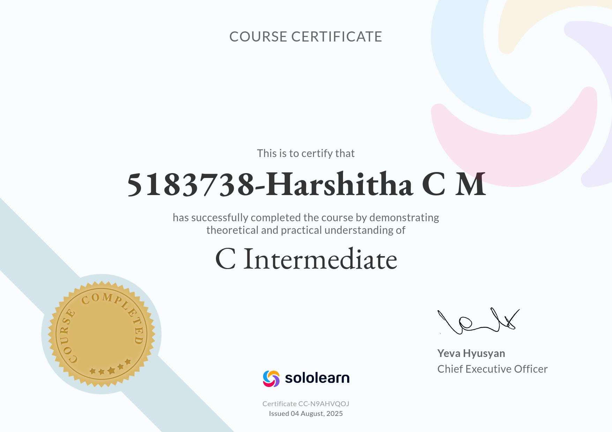
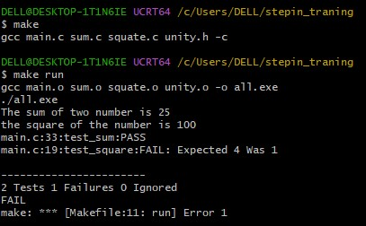
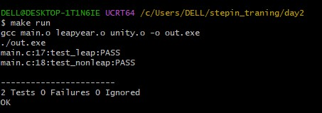
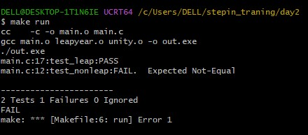
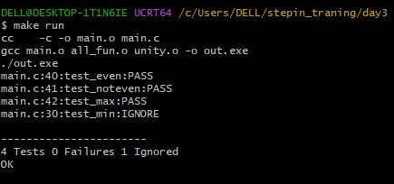
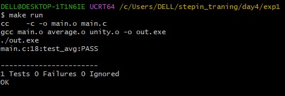
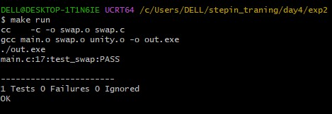

# 5183738_Harshitha_C_M

## 📚 Overview

Welcome to my repository! This space documents my journey through:

- 📘 SDLC (Software Development Life Cycle)
- 🛠️ Git and version control
- 🐧 Linux command line
- 💻 C programming fundamentals
- 💻 Unity FrameWork
- 🐧 HarkerRank

Each section includes **certificates** and **practical command-line exercises** to demonstrate what I’ve learned.

---

## 🏆 My Certificates

### ✅ Week 1 – SDLC

   
  

---

### ✅ Week 2 – Git

  

---

### ✅ Week 3 – Linux Command Line Practice

📸 **Command execution screenshots:**

  
  
  
  
  
  
  
  
  
  

---

### ✅ Week 4 – C Programming Essentials

  
  

---

### ✅ Week 5 – Unity Framework

  <h2>Test 1</h2>
  
  

  <h2>Test 2</h2>
  
  

  <h2>Test 3</h2>
  
  
  

  <h2>Test 4</h2>
  
  

  <h2>Test 5</h2>
  
  

  <h2>Test 6</h2>
  
  

---
### ✅ HakerRank 

  <h2> Problem_solving_basic certificate </h2>
  
  <h2> Problem_solving_intermediate certificate </h2>
   Problem_solving_basic certificate </h2>
  " alt="certificate" width="500">

---