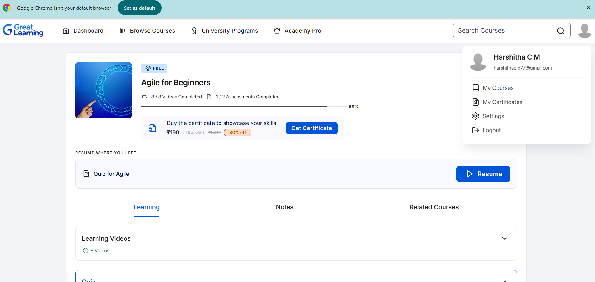
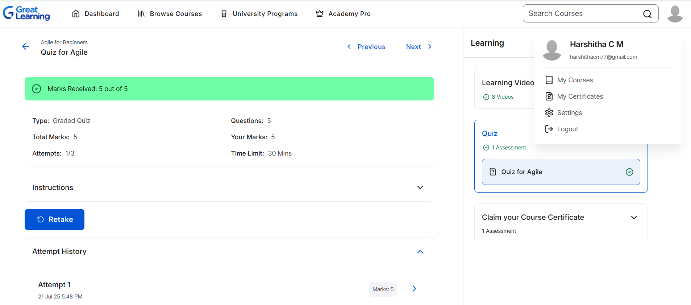

# 5183738_Harshitha_C_M

## 📚 Overview

Welcome to my repository! This space documents my journey through:

- 📘 SDLC (Software Development Life Cycle)
- 🛠️ Git and version control
- 🐧 Linux command line
- 💻 C programming fundamentals

Each section includes **certificates** and **practical command-line exercises** to demonstrate what I’ve learned.

---

## 🏆 My Certificates

### ✅ Week 1 – SDLC

   
  

---

### ✅ Week 2 – Git

  

---

### ✅ Week 3 – Linux Command Line Practice

> **Key Concepts Practiced:**
> - Navigating the file system
> - Basic file operations (`ls`, `cp`, `mv`, `cat`, `rm`, etc.)
> - Viewing and editing files (`nano`, `head`, `tail`, `sort`, `cut`, `rev`)
> - Text processing using `grep`, `sed`, `awk`, and `tr`
> - Working with pipes, I/O redirection
> - Understanding system info (`uname`, `ps`, `wc`, etc.)

📸 **Command execution screenshots:**

  
  
  
  
  
  
  
  
  
  

---

### ✅ Week 4 – C Programming Essentials

> **Topics Covered:**
> - Structure of a C program
> - Variables and data types
> - Input/output operations
> - Control flow: `if`, `switch`, `for`, `while`
> - Use of preprocessor directives like `#include` and `#define`
> - Working with GCC and compiling programs

  

---

## 🧭 Navigation

Explore week-wise folders for full content:

- 📁 [Week 1 - SDLC](./SDLC_week1/)
- 📁 [Week 2 - Git](./Git_week2/)
- 📁 [Week 3 - Linux](./Linux_week3/)
- 📁 [Week 4 - C Programming](./Essentials_of_C_Programming_week4/)

---
